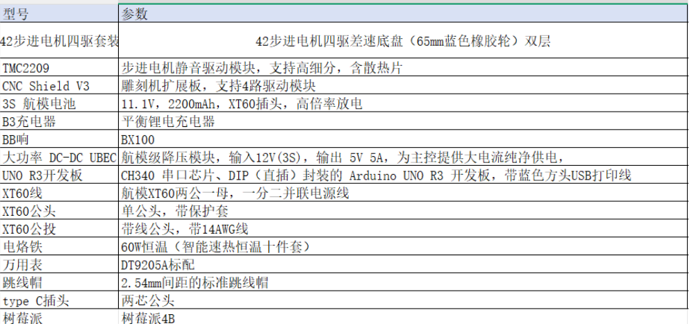
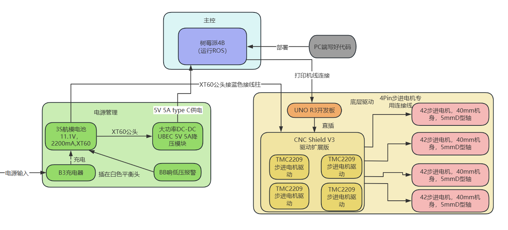
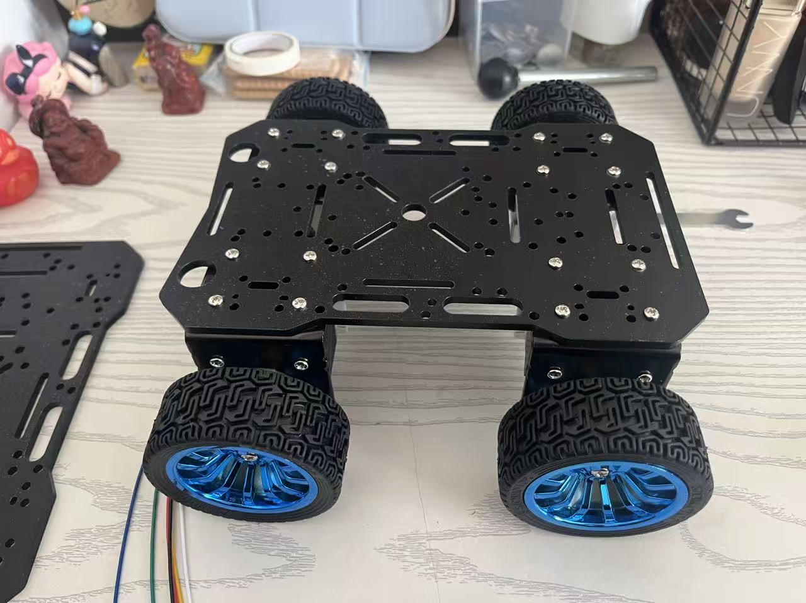
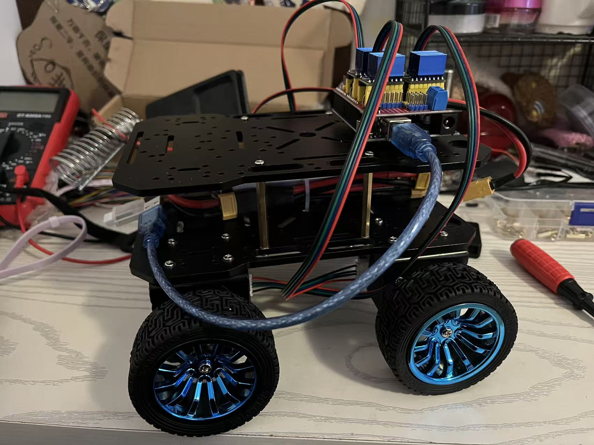
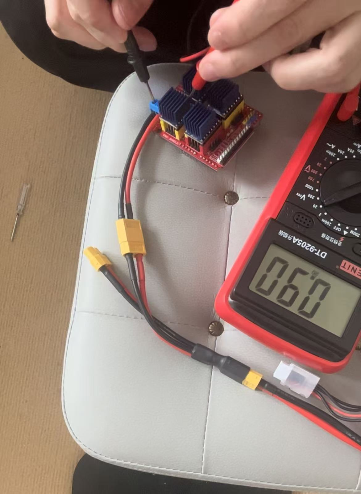

# smart-car-repo

### 一、前期硬件选型

### 二、系统框图

### 三、系统搭建以及测试

#### 3.1组装42电机以及轮子

!

#### 3.2组装上层驱动

将TMC2209固定至CNC shield V3，并将42步进电机与TMC2209电机驱动模块相连

连接电池测试驱动模块，用万用表测量TMC2209模块的VREF，使用螺丝刀扭动螺丝，使VREF的值保持在0.9V左右，并小心静电击穿。

测试完毕后，使用铜柱将开发板固定好

#### 3.4编写树莓派linux内核驱动代码测试

打开 `src/raspberry_pi_4b_code/driver/` 文件夹

编写 C 语言驱动源码 (`stepper_driver.c`)

~~~c
#include <linux/module.h>
#include <linux/init.h>
#include <linux/gpio.h>
#include <linux/fs.h>
#include <linux/uaccess.h>

// 给驱动起名字
#define DRIVER_NAME "stepper_gpio_driver"
// 设定要控制的树莓派引脚
#define STEP_PIN 17 

static int major_number; // 用于保存系统分配给这个驱动的主设备号
static ssize_t dev_write(struct file *filep, const char *buffer, size_t len, loff_t *offset) {
    char cmd;
    
    // 把传进来的指令安全地拷贝到内核里
    if (copy_from_user(&cmd, buffer, 1)) {
        return -EFAULT;
    }

    // 根据指令控制引脚的电压S
    if (cmd == '1') {
        gpio_set_value(STEP_PIN, 1); // 输出高电平
    } else if (cmd == '0') {
        gpio_set_value(STEP_PIN, 0); // 输出低电平
    }
    return len;
}

static struct file_operations fops = {
    .write = dev_write,
};

static int __init stepper_driver_init(void) {
    printk(KERN_INFO "Stepper Driver: 正在启动电机驱动...\n");

    //向系统申请霸占 GPIO 17 引脚
    if (!gpio_is_valid(STEP_PIN)) {
        printk(KERN_ERR "Stepper Driver: 申请 GPIO 引脚失败！\n");
        return -ENODEV;
    }
    gpio_request(STEP_PIN, "sysfs");
    gpio_direction_output(STEP_PIN, 0); // 默认先输出低电平，防止电机乱动

    // 向系统注册这个驱动，并获取“身份证号”
    major_number = register_chrdev(0, DRIVER_NAME, &fops);
    if (major_number < 0) {
        printk(KERN_ERR "Stepper Driver: 注册失败！\n");
        gpio_free(STEP_PIN);
        return major_number;
    }
    
    printk(KERN_INFO "Stepper Driver: 注册成功！分配的主设备号是 %d\n", major_number);
    return 0;
}

static void __exit stepper_driver_exit(void) {
    unregister_chrdev(major_number, DRIVER_NAME); // 注销身份证号
    gpio_set_value(STEP_PIN, 0);                  // 安全起见，电压拉低
    gpio_free(STEP_PIN);                          // 把引脚还给系统
    printk(KERN_INFO "Stepper Driver: 驱动已安全卸载。\n");
}

// 标记入口和出口函数
module_init(stepper_driver_init);
module_exit(stepper_driver_exit);

// 必须声明开源许可证，否则 Linux 内核会拒绝加载
MODULE_LICENSE("GPL");
MODULE_AUTHOR("Ray");
MODULE_DESCRIPTION("树莓派步进电机高精度 GPIO 驱动");
~~~

编写编译规则 (`Makefile`)

~~~ c
# 告诉编译器我们要生成的驱动文件名叫什么
obj-m += stepper_driver.o

# 【极其重要】指向你刚刚下载好的树莓派内核源码的路径
# $(USER) 会自动获取你当前的 Linux 用户名S
KDIR := /home/ray/linux

PWD := $(shell pwd)

all:
	make -C $(KDIR) M=$(PWD) ARCH=arm64 CROSS_COMPILE=aarch64-linux-gnu- modules

clean:
	make -C $(KDIR) M=$(PWD) clean
~~~

#### 3.5 把树莓派官方的**Linux 内核源码**下载到 WSL 环境里

进入linux主目录

~~~ 
cd ~
~~~

执行克隆命令开始下载

~~~
git clone --depth=1 https://github.com/raspberrypi/linux.git
~~~

下载完成，查看

进入内核源码目录

~~~
cd ~/linux
~~~

加载树莓派 4B 的默认配置

~~~
make ARCH=arm64 CROSS_COMPILE=aarch64-linux-gnu- bcm2711_defconfig
~~~

生成一些脚本和头文件

~~~
make ARCH=arm64 CROSS_COMPILE=aarch64-linux-gnu- modules_prepare
~~~

回到写底层代码的 D 盘文件夹

~~~
cd /mnt/d/car/smart-car-repo/src/raspberry_pi_4b_code/driver/
~~~

然后make

#### 3.6 把驱动传送到树莓派

~~~
cd /mnt/d/car/smart-car-repo/src/raspberry_pi_4b_code/driver/
scp stepper_driver.ko ray@192.168:~
~~~

#### 3.7 把树莓派当大脑，arduino当作小脑

编写 Arduino “小脑”固件，使用串口通信，接受树莓派的指令，然后交由arduino来处理

~~~c++
#include <linux/module.h>
#include <linux/init.h>
#include <linux/gpio.h>
#include <linux/fs.h>
#include <linux/uaccess.h>

#define DRIVER_NAME "stepper_gpio_driver"
// 假设将树莓派的 GPIO 17 引脚连接到 CNC Shield V3 对应的 STEP 引脚
#define STEP_PIN 17 

static int major_number;

// 这个函数负责接收外部传来的指令（1或0），并控制引脚电平
static ssize_t dev_write(struct file *filep, const char *buffer, size_t len, loff_t *offset) {
    char cmd;
    // 将应用层（比如你以后写的 Python 脚本）发来的指令拷贝进内核
    if (copy_from_user(&cmd, buffer, 1)) {
        return -EFAULT;
    }

    // 判断指令并操作底层硬件
    if (cmd == '1') {
        gpio_set_value(STEP_PIN, 1); // 输出高电平
    } else if (cmd == '0') {
        gpio_set_value(STEP_PIN, 0); // 输出低电平
    }
    return len;
}

// 绑定设备的文件操作接口
static struct file_operations fops = {
    .write = dev_write,
};

// 驱动加载时的初始化动作
static int __init stepper_driver_init(void) {
    printk(KERN_INFO "Stepper Driver: 正在初始化...\n");

    // 检查并申请树莓派的 GPIO 引脚
    if (!gpio_is_valid(STEP_PIN)) {
        printk(KERN_ERR "Stepper Driver: 无效的 GPIO 引脚\n");
        return -ENODEV;
    }
    gpio_request(STEP_PIN, "sysfs");
    gpio_direction_output(STEP_PIN, 0); // 初始状态设为低电平

    // 注册这个字符设备驱动
    major_number = register_chrdev(0, DRIVER_NAME, &fops);
    if (major_number < 0) {
        printk(KERN_ERR "Stepper Driver: 注册主设备号失败\n");
        gpio_free(STEP_PIN);
        return major_number;
    }
    printk(KERN_INFO "Stepper Driver: 注册成功，分配的主设备号是 %d\n", major_number);
    return 0;
}

// 驱动卸载时的清理动作
static void __exit stepper_driver_exit(void) {
    unregister_chrdev(major_number, DRIVER_NAME);
    gpio_set_value(STEP_PIN, 0); // 安全起见，卸载时拉低电平
    gpio_free(STEP_PIN);         // 释放对该引脚的控制权
    printk(KERN_INFO "Stepper Driver: 驱动已卸载。\n");
}

module_init(stepper_driver_init);
module_exit(stepper_driver_exit);

MODULE_LICENSE("GPL");
MODULE_AUTHOR("Your Name");
MODULE_DESCRIPTION("树莓派底层步进电机 GPIO 驱动");
~~~

树莓派端

~~~python
import serial
import serial.tools.list_ports
import time
import sys
import tty
import termios

# ==========================================
# 1. 自动寻找 Arduino 串口
# ==========================================
def find_arduino():
    print("正在寻找 Arduino 的大脑...")
    ports = serial.tools.list_ports.comports()
    for p in ports:
        # 匹配常见的 Arduino 串口名称
        if "ACM" in p.device or "USB" in p.device:
            return p.device
    return None

SERIAL_PORT = find_arduino()

if SERIAL_PORT is None:
    print("❌ 找不到 Arduino！请检查 USB 线是否插好。")
    sys.exit()

BAUD_RATE = 115200

try:
    ser = serial.Serial(SERIAL_PORT, BAUD_RATE, timeout=1)
    time.sleep(2) # 等待 Arduino 重启就绪
    print(f"✅ 成功连接到底盘，当前端口: {SERIAL_PORT}")
except Exception as e:
    print(f"❌ 串口连接失败: {e}")
    sys.exit()

# ==========================================
# 2. 控制逻辑与基础参数
# ==========================================
SPEED = 800  # 设定标准速度

def send_cmd(fl, rl, fr, rr):
    """格式化并发送 4 个轮子的速度指令给 Arduino"""
    command = f"{fl},{rl},{fr},{rr}\n"
    ser.write(command.encode('utf-8'))

def getch():
    """实时读取键盘按键（阻塞式读取，无需按回车）"""
    fd = sys.stdin.fileno()
    old_settings = termios.tcgetattr(fd)
    try:
        tty.setraw(sys.stdin.fileno())
        ch = sys.stdin.read(1)
    finally:
        termios.tcsetattr(fd, termios.TCSADRAIN, old_settings)
    return ch

# ==========================================
# 3. 运行主循环 (驾驶舱)
# ==========================================
print("""
=== 🏎️ 树莓派四驱小车驾驶舱已启动 ===
  【日常行驶】(长按行驶，松开1秒后自动急刹)
    W: 直线前进    S: 直线后退
    A: 丝滑左转    D: 丝滑右转
  
  【极限机动】(木地板上阻力较大，会伴随震动声)
    Q: 原地左掉头  E: 原地右掉头
  
  【安全控制】
    Space (空格): 紧急手动刹车
    X: 安全退出程序
========================================
""")

try:
    while True:
        key = getch().lower()
        
        # 设定差速转弯时的慢速比例 (0.3 代表内侧轮子只出 30% 的力气)
        SLOW_SPEED = int(SPEED * 0.5) 

        if key == 'w':
            print("↑ 直线前进")
            send_cmd(SPEED, SPEED, SPEED, SPEED)
            
        elif key == 's':
            print("↓ 直线后退")
            send_cmd(-SPEED, -SPEED, -SPEED, -SPEED)
            
        elif key == 'a':
            print("↖ 丝滑左转 (左轮慢，右轮快)")
            send_cmd(SLOW_SPEED, SLOW_SPEED, SPEED, SPEED)
            
        elif key == 'd':
            print("↗ 丝滑右转 (左轮快，右轮慢)")
            send_cmd(SPEED, SPEED, SLOW_SPEED, SLOW_SPEED)
            
        elif key == 'q':
            print("🔄 原地左死角掉头")
            send_cmd(-SPEED, -SPEED, SPEED, SPEED)
            
        elif key == 'e':
            print("🔄 原地右死角掉头")
            send_cmd(SPEED, SPEED, -SPEED, -SPEED)
            
        elif key == ' ':
            print("█ 紧急手动刹车")
            send_cmd(0, 0, 0, 0)
            
        elif key == 'x': 
            print("退出程序...")
            send_cmd(0, 0, 0, 0)
            break
            
except KeyboardInterrupt:
    # 防止按 Ctrl+C 强制退出时小车失控
    send_cmd(0, 0, 0, 0)
finally:
    if ser.is_open:
        ser.close()
    print("\n✅ 串口已安全关闭，系统离线。")
~~~

小车键盘控制测试照片

控制测试视频，见/video文件夹

### 四、硬件驱动搭建

#### 4.1 摄像头驱动

硬件选型：树莓派csi摄像头及摄像头支架

抓取 OV5647 的画面，并将其转换为可以通过浏览器访问的视频流

~~~~c
#include <stdio.h>
#include <stdlib.h>
#include <fcntl.h>
#include <unistd.h>
#include <sys/ioctl.h>
#include <linux/videodev2.h>

int main() {
    // 尝试打开默认的摄像头设备节点
    int fd = open("/dev/video0", O_RDWR);
    if (fd == -1) {
        perror("Error: 无法打开摄像头设备 /dev/video0");
        return 1;
    }

    // 查询摄像头能力/属性
    struct v4l2_capability cap;
    if (ioctl(fd, VIDIOC_QUERYCAP, &cap) == -1) {
        perror("Error: 无法查询设备属性");
        close(fd);
        return 1;
    }

    printf("==============================\n");
    printf("成功连接 OV5647 (或默认摄像头)!\n");
    printf("驱动程序: %s\n", cap.driver);
    printf("设备名称: %s\n", cap.card);
    printf("总线信息: %s\n", cap.bus_info);
    printf("版本号: %u.%u.%u\n", 
            (cap.version >> 16) & 0xFF, 
            (cap.version >> 8) & 0xFF, 
            cap.version & 0xFF);
    printf("==============================\n");

    close(fd);
    return 0;
}
~~~~

